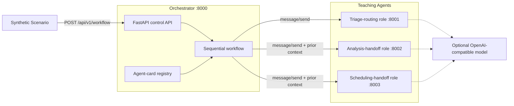

# Build a multi-agent workflow demo for health scenarios

Learn agent discovery, sequential delegation, context passing, and failure handling with synthetic data and clearly labeled outputs.

## Table of Contents

- [Overview](#overview)
- [Who is this for](#who-is-this-for)
- [Example use cases](#example-use-cases)
- [Detailed description](#detailed-description)
  - [Architecture diagrams](#architecture-diagrams)
- [What this teaches](#what-this-teaches)
- [What this is not](#what-this-is-not)
- [Adapt the pattern](#adapt-the-pattern)
- [Requirements](#requirements)
  - [Minimum hardware requirements](#minimum-hardware-requirements)
  - [Minimum software requirements](#minimum-software-requirements)
  - [Required user permissions](#required-user-permissions)
- [Deploy](#deploy)
  - [Prerequisites](#prerequisites)
  - [Installation](#installation)
  - [Validating the deployment](#validating-the-deployment)
  - [Delete](#delete)
- [Repository structure](#repository-structure)
- [References](#references)
- [Tags](#tags)

## Overview

This quickstart demonstrates a small multi-agent application: an orchestrator discovers three role-based services from example agent cards, sends JSON-RPC messages to them in sequence, carries each result into the next step, and stops cleanly when a step fails. The health scenario is only a familiar frame for learning the software pattern.

The included roles are named triage, clinical, and scheduling, but they do not make medical decisions or connect to health systems. Demo responses describe software handoffs and are labeled `DEMO SIMULATION`. The same routing pattern can be adapted to support, document review, incident response, onboarding, or another domain.

## Who is this for

- **Application developers** learning service discovery and sequential agent delegation
- **Solution architects** exploring how small agent services exchange typed messages
- **Platform teams** comparing local Compose and OpenShift deployment paths

## Example use cases

- Inspect how an orchestrator discovers role-specific services
- Trace context as it moves through a three-step synthetic workflow
- Observe how a downstream step is prevented from running after an upstream failure
- Replace the example roles with agents from a non-clinical application you build

## Detailed description

Each agent exposes an example card at `/.well-known/agent-card.json` and a JSON-RPC endpoint at `/a2a`. The orchestrator reads the cards, keeps an in-memory registry, and calls `message/send` for each configured workflow step. Completed tasks are retained in a bounded in-memory store and can be read with `tasks/get` until the process restarts or the oldest entry is evicted.

The wire shape is intentionally a small **A2A 0.3-style teaching subset**. It demonstrates discovery cards, JSON-RPC messages, tasks, artifacts, and sequential delegation. It is not an A2A conformance implementation and does not implement streaming, authentication, push notifications, durable task storage, every task state, or the current A2A 1.0 data model. Use an official SDK and the latest specification when interoperability is the goal.

There are two execution modes:

- **Demo mode** requires no model. Every artifact identifies `demo-simulator`, states that no medical or external action occurred, and reports only measured wall-clock latency.
- **Live-model mode** calls an OpenAI-compatible endpoint. Outputs remain labeled as model-generated architecture-demo content. If the model fails, the agent returns an error and the orchestrator stops; it never silently substitutes a simulated result.

The services do not include authentication, authorization, encryption configuration, audit storage, privacy controls, or connections to clinical, scheduling, messaging, or emergency systems. This educational simulation is not medical advice. Use invented scenarios and synthetic data only.

### Architecture diagrams



## What this teaches

- Publishing and validating small agent-card documents
- Sending JSON-RPC messages and returning task artifacts
- Discovering independently deployed agent services
- Passing bounded context through sequential workflow steps
- Distinguishing liveness from dependency readiness
- Labeling simulator and live-model output without silent fallback
- Packaging one Python image for multiple process roles

## What this is not

- Medical advice, diagnosis, treatment, triage, scheduling, or emergency support
- A connection to an electronic health record, appointment system, or notification service
- A system for personal, patient, or protected health information
- A production agent platform or an A2A conformance implementation
- Evidence of model quality, clinical safety, workflow accuracy, or performance on target hardware

## Adapt the pattern

1. Rename the example roles and workflows in `src/agent.py` and `src/orchestrator.py`.
2. Replace the fixed demo responses with harmless examples from your own domain.
3. Update `WorkflowRequest`, the JSON-RPC payload models, and both OpenAPI contracts.
4. Add authentication, authorization, durable task storage, observability, and domain-specific data controls.
5. Use the current A2A specification or an official SDK if cross-implementation compatibility is required.
6. Add labeled evaluation cases before treating any model output as application behavior.

## Requirements

### Minimum hardware requirements

- Demo mode: 2 CPU cores, 4 GiB memory, and 2 GiB free storage
- Included Ollama example: 4 CPU cores, 8 GiB memory, and 5 GiB free storage
- External model endpoints have their own capacity requirements

No GPU is required for the simulator or the included small Ollama model example.

### Minimum software requirements

- Python 3.10 or later, Bash, and `curl` for `demo.sh`
- Podman Compose or Docker Compose for the local container path
- Red Hat OpenShift 4.14 or later and Helm 3.12 or later for the chart
- `oc` CLI authenticated to the target OpenShift cluster
- Ollama is optional for the one-command launcher and included in the Compose live-model path

### Required user permissions

For OpenShift, the user must be able to create deployments, services, routes, image streams, build configurations, pods, and secrets in the target namespace. An existing-image deployment can disable the source build.

## Deploy

### Prerequisites

Clone the repository:

```bash
git clone https://github.com/jkershawrh/multi-agent-health-assistant.git
cd multi-agent-health-assistant
```

Use synthetic data only. Do not paste real personal or health information into the demo or a model endpoint.

### Installation

**Fastest path: one-command local demo**

The launcher creates a virtual environment and starts three agents, the orchestrator, and the Gradio UI. It uses a configured model endpoint or an available local Ollama model; otherwise it starts the labeled simulator.

```bash
./demo.sh
# Open http://localhost:7860
```

Force the simulator even when Ollama is installed:

```bash
DEMO_MODE=true ./demo.sh
```

**Local Compose with Ollama**

```bash
docker compose up -d

# Add the UI at http://localhost:7860
docker compose --profile ui up -d
```

The `ollama-pull` service downloads `qwen2.5:1.5b` before the agents become ready.

Run only the simulator without starting Ollama:

```bash
DEMO_MODE=true docker compose up --no-deps -d \
  triage-agent clinical-agent scheduling-agent orchestrator

docker compose --profile ui up --no-deps -d ui
```

**OpenShift demo deployment**

The default chart creates an OpenShift `BuildConfig` and `ImageStream`, builds this repository's `src/Containerfile`, and reuses the resulting image for every role. No external model is required.

```bash
oc new-project multi-agent-health-assistant

helm upgrade --install multi-agent-health-assistant chart/

# Follow the first source build, then wait for the API rollout.
oc logs -f bc/multi-agent-health-assistant
oc rollout status deployment/multi-agent-health-assistant-orchestrator --timeout=10m
```

To deploy an existing image instead of building from source:

```bash
helm upgrade --install multi-agent-health-assistant chart/ \
  --set build.enabled=false \
  --set image.repository=registry.example.com/team/multi-agent-health-assistant \
  --set image.tag=<tag>
```

To use an authenticated OpenAI-compatible endpoint, create a Secret and pass its name. The endpoint may be the provider root or end in `/v1` and must expose `/v1/models` and `/v1/chat/completions`.

```bash
oc create secret generic health-demo-model \
  --from-literal=api-key='<api-key>'

helm upgrade --install multi-agent-health-assistant chart/ \
  --set model.endpoint=<endpoint-url> \
  --set model.name=<model-name> \
  --set model.existingSecret=health-demo-model
```

### Validating the deployment

```bash
# Local readiness
curl -s http://localhost:8000/ready

# Run a harmless synthetic workflow
curl -s http://localhost:8000/api/v1/workflow \
  -H "Content-Type: application/json" \
  -d '{"query":"Synthetic intake event for routing demonstration","workflow_type":"patient_triage"}' \
  | python3 -m json.tool

# OpenShift route and Helm smoke test
ROUTE_HOST="$(oc get route multi-agent-health-assistant -o jsonpath='{.spec.host}')"
curl -s "https://${ROUTE_HOST}/ready"
helm test multi-agent-health-assistant

# Local automated checks
python -m pip install -r src/requirements.txt pytest openapi-spec-validator ruff==0.16.4
python -m pytest -q
ruff check src tests
```

### Delete

```bash
helm uninstall multi-agent-health-assistant
oc delete project multi-agent-health-assistant
```

For local Compose:

```bash
docker compose down
```

## Repository structure

```text
.
├── .env.example
├── .github/workflows/ci.yaml
├── chart/
│   ├── Chart.yaml
│   ├── values.yaml
│   └── templates/
│       ├── build.yaml
│       ├── orchestrator-deployment.yaml
│       ├── agent-deployments.yaml
│       └── test-workflow.yaml
├── contracts/openapi/
│   ├── orchestrator.yaml
│   └── agent.yaml
├── src/
│   ├── orchestrator.py
│   ├── agent.py
│   ├── models.py
│   ├── ui.py
│   ├── Containerfile
│   └── requirements.txt
├── tests/
│   ├── contracts/
│   ├── unit/
│   ├── integration/
│   ├── benchmarks/
│   └── publication/
├── demo.sh
├── docker-compose.yml
├── Makefile
├── LICENSE
└── README.md
```

## References

- [Latest A2A protocol specification](https://a2a-protocol.org/latest/specification/) -- current interoperability requirements and data model
- [A2A 0.3 specification](https://a2a-protocol.org/v0.3.0/specification/) -- the version whose discovery and JSON-RPC concepts shape this teaching subset
- [JSON-RPC 2.0 specification](https://www.jsonrpc.org/specification)
- [FastAPI documentation](https://fastapi.tiangolo.com/)
- [Ollama documentation](https://docs.ollama.com/)
- [OpenShift builds documentation](https://docs.redhat.com/en/documentation/openshift_container_platform/latest/html/builds_using_buildconfig/understanding-image-builds)

## Tags

- **Title:** Build a multi-agent workflow demo for health scenarios
- **Description:** Learn discovery, delegation, context passing, and failure handling with synthetic data and clearly labeled outputs.
- **Industry:** Healthcare provider
- **Product:** Red Hat OpenShift AI
- **Use case:** AI inference
- **Partner:** Intel
- **Contributor org:** Red Hat
