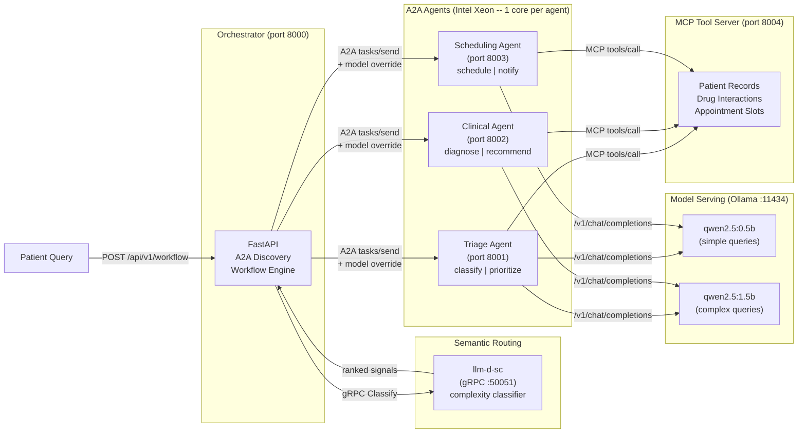
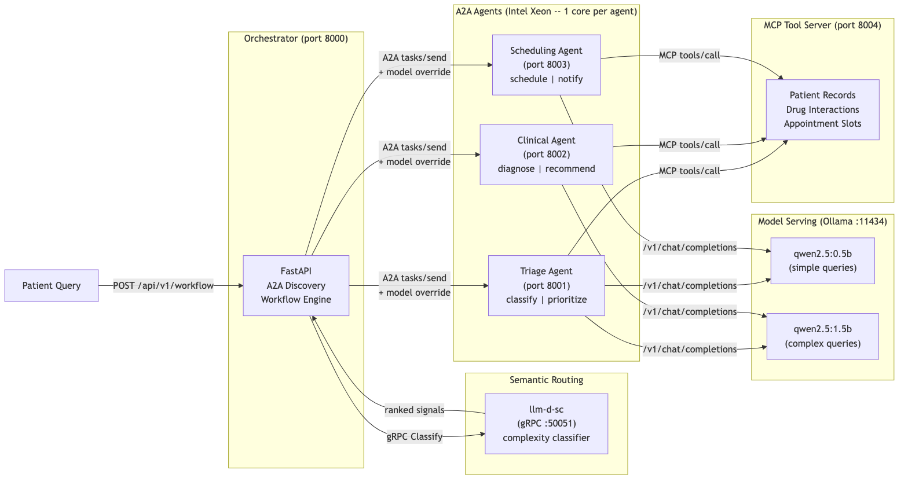

# Coordinate AI agents to assist healthcare workflows

Deploy cooperating AI agents that discover, classify, and delegate tasks to support clinical and administrative workflows.

## Table of Contents

- [Overview](#overview)
- [Who is this for](#who-is-this-for)
- [Example use cases](#example-use-cases)
- [Detailed description](#detailed-description)
  - [Architecture diagrams](#architecture-diagrams)
- [Requirements](#requirements)
  - [Minimum hardware requirements](#minimum-hardware-requirements)
  - [Minimum software requirements](#minimum-software-requirements)
  - [Required user permissions](#required-user-permissions)
- [Deploy](#deploy)
  - [Prerequisites](#prerequisites)
  - [Installation](#installation)
  - [Validating the deployment](#validating-the-deployment)
  - [Delete](#delete)
- [Repository structure](#repository-structure)
- [References](#references)
- [Tags](#tags)

## Overview

Healthcare providers need AI systems that can coordinate across specialties -- triage, clinical analysis, and scheduling -- without creating data silos or vendor lock-in. This quickstart deploys three cooperative AI agents that discover each other using the Agent-to-Agent (A2A) protocol and execute multi-step patient triage workflows. An llm-d semantic classifier (llm-d-sc) classifies incoming queries by complexity and automatically selects the right workflow depth -- routing simple requests to fewer agents and complex cases to the full clinical pipeline. Healthcare IT teams can use this as a starting point for building interoperable multi-agent systems on Red Hat OpenShift AI with Intel Xeon processors.

## Who is this for

- **Healthcare IT architects** designing multi-agent platforms that coordinate across clinical departments without vendor lock-in.
- **System integrators** building interoperable AI services that communicate through open protocols like A2A, MCP, and JSON-RPC 2.0.
- **DevOps teams** deploying cooperative AI agent workloads on Red Hat OpenShift AI with Intel Xeon processors for predictable, core-pinned performance.
- **AI engineers** evaluating agentic patterns: semantic routing, tool calling, inter-agent authentication, and multi-model orchestration.

## Example use cases

- **Patient triage and routing** -- Classify symptom urgency and route patients to the appropriate care pathway automatically.
- **Clinical decision support** -- Generate differential diagnoses and evidence-based treatment recommendations from patient presentations.
- **Appointment scheduling** -- Book follow-up visits, assign providers, and send appointment confirmations based on clinical priority.
- **Care coordination across departments** -- Chain multiple specialized agents to execute end-to-end workflows spanning triage, diagnosis, and scheduling.

## Detailed description

Patient care coordination requires multiple specialized functions working together: assessing urgency, forming a clinical picture, and scheduling follow-up. Traditional monolithic systems bundle these into a single service, making it difficult to update, scale, or replace individual components. This quickstart decomposes the problem into three independent agents -- triage, clinical, and scheduling -- that communicate through the open A2A protocol.

Each agent publishes a machine-readable agent card at `/.well-known/agent-card.json` describing its capabilities and skills. The orchestrator discovers agents automatically, maintains a live registry, and delegates tasks through JSON-RPC 2.0 calls. Before executing a workflow, the orchestrator sends the patient query to llm-d-sc -- a low-latency Rust semantic classifier from the llm-d project -- which ranks the query's complexity (SIMPLE, MEDIUM, COMPLEX, REASONING). The orchestrator uses this signal to select the workflow depth: simple queries route only to the scheduling agent, moderate queries add triage, and complex cases invoke the full triage-clinical-scheduling pipeline. When llm-d-sc is unavailable, the orchestrator falls back to the comprehensive workflow. Every step records measured latency for observability.

The system runs on a local Ollama instance serving two Qwen 2.5 models on Intel Xeon CPU: `qwen2.5:0.5b` for simple queries and `qwen2.5:1.5b` for complex cases. The semantic classifier selects the model tier alongside the workflow depth, so simple appointment requests use a fast lightweight model while complex clinical cases use the more capable one. Each agent is pinned to a dedicated Intel Xeon core for isolation and predictable performance.

Agents call an MCP (Model Context Protocol) tool server during task processing. Three healthcare tools are available: patient record lookup, drug interaction checking, and appointment slot finding. When a query mentions medications, patient IDs, or scheduling, the relevant tools fire automatically and their results are woven into the agent's response. A bearer token authentication middleware secures inter-agent communication on the `/a2a` endpoint while keeping health checks and agent card discovery open for Kubernetes probes and A2A protocol compliance.

A demo mode is available for evaluation and development without LLM backends. All responses carry an AI disclaimer: agent responses are AI-generated -- verify clinical recommendations with qualified healthcare professionals.

A Gradio UI provides three views: a patient workflow tab for running end-to-end triage queries with semantic routing results and step-by-step latency reporting, an agent registry tab showing discovered agents and their capabilities, and a statistics tab with system health information.


### Architecture diagrams





## Requirements

### Minimum hardware requirements

- 6 CPU cores (Intel Xeon recommended -- 1 per agent + 1 orchestrator + 1 MCP server + 1 llm-d-sc)
- 12 GiB memory (6 GiB for Ollama with 2 models + 4 GiB for services + 2 GiB for llm-d-sc)
- 8 GiB storage (2 model weights + llm-d-sc classifier artifact + container images)

### Minimum software requirements

- Red Hat OpenShift 4.14+ or OpenShift AI 2.7+
- Helm 3.12+
- `oc` CLI 4.14+
- Podman 4.0+ or Docker Compose (for local development)

### Required user permissions

This quickstart can be deployed by a regular user with namespace-level permissions.

## Deploy

### Prerequisites

- Access to a Red Hat OpenShift cluster or local Podman installation
- `helm` and `oc` CLI tools installed
- No external model endpoint required (Ollama is included in the Compose stack; demo mode works without any LLM backend)

### Installation

1. Clone the repository:

```bash
git clone https://github.com/rh-ai-quickstart/multi-agent-health-assistant.git
cd multi-agent-health-assistant
```

2. Copy and configure environment variables:

```bash
cp .env.example .env
# Edit .env to set DEMO_MODE=true if you want demo responses without Ollama
```

3. **Option A: Quick start with demo.sh** (recommended for first run)

```bash
./demo.sh
# Automatically detects Ollama, pulls both models, starts all services
# Open http://localhost:7860 for the Gradio UI (requires Python 3.10+)
```

4. **Option B: Local development with Podman Compose**

```bash
podman compose up -d
# Ollama will pull qwen2.5:0.5b and qwen2.5:1.5b on first start
# llm-d-sc model artifacts are downloaded automatically
# Verify all services are healthy
curl http://localhost:8000/health   # Orchestrator
curl http://localhost:8001/health   # Triage agent
curl http://localhost:8002/health   # Clinical agent
curl http://localhost:8003/health   # Scheduling agent
curl http://localhost:8004/health   # MCP tool server
```

5. **Option C: Deploy to OpenShift with Helm**

Create an OpenShift project:

```bash
oc new-project multi-agent-health-assistant
```

Install using Helm:

```bash
helm install multi-agent-health-assistant chart/
```

6. **Enable agent authentication** (optional):

```bash
# Set a shared token in .env or export before starting
export AGENT_AUTH_TOKEN=my-secret-token
# All inter-agent A2A calls will require this bearer token
# Health and agent-card endpoints remain open for K8s probes
```

### Validating the deployment

```bash
# Check pod status
oc get pods

# Get the application URL
ROUTE_URL="https://$(oc get route multi-agent-health-assistant -o jsonpath='{.spec.host}')"

# Discover agents and check semantic routing status
curl "$ROUTE_URL/health"
curl "$ROUTE_URL/api/v1/agents"

# Run a simple query (lightweight workflow -- scheduling only)
curl -X POST "$ROUTE_URL/api/v1/workflow" \
  -H "Content-Type: application/json" \
  -d '{"query": "Schedule a follow-up appointment", "workflow_type": "lightweight"}'

# Run a complex query (comprehensive workflow -- all 3 agents)
curl -X POST "$ROUTE_URL/api/v1/workflow" \
  -H "Content-Type: application/json" \
  -d '{"query": "Patient with chest pain and shortness of breath", "workflow_type": "comprehensive"}'

# Auto-route (let llm-d-sc decide workflow depth and model)
curl -X POST "$ROUTE_URL/api/v1/workflow" \
  -H "Content-Type: application/json" \
  -d '{"query": "Check patient record PAT-001 and schedule appointment"}'

# Verify MCP tools are available
curl http://localhost:8004/health

# Run Helm test
helm test multi-agent-health-assistant
```

### Delete

```bash
helm uninstall multi-agent-health-assistant
oc delete project multi-agent-health-assistant
```

## Repository structure

```
.
├── .env.example              # Environment variable template
├── .github/
│   └── workflows/
│       └── ci.yaml           # GitHub Actions CI pipeline
├── chart/                    # Helm chart for OpenShift deployment
│   ├── Chart.yaml
│   ├── values.yaml
│   └── templates/
│       ├── orchestrator-deployment.yaml
│       ├── agent-deployments.yaml
│       ├── mcp-server-deployment.yaml
│       ├── semantic-router-deployment.yaml
│       └── test-model-access.yaml
├── contracts/                # API contracts (OpenAPI)
│   └── openapi/
│       ├── orchestrator.yaml # Orchestrator API (discovery, workflow, routing)
│       ├── agent.yaml        # Agent API (A2A protocol, JSON-RPC)
│       └── mcp.yaml          # MCP tool server API
├── docs/
│   └── images/               # Architecture diagrams and screenshots
│       ├── architecture.png
│       └── screenshot.png
├── src/                      # Application source code
│   ├── orchestrator.py       # FastAPI orchestrator with semantic routing
│   ├── agent.py              # A2A-compliant agent with MCP tool calling
│   ├── models.py             # Pydantic models for A2A protocol
│   ├── auth.py               # Bearer token auth middleware
│   ├── mcp_server.py         # MCP tool server (patient records, drugs, scheduling)
│   ├── ui.py                 # Gradio UI (patient workflow, registry, stats)
│   ├── classify_pb2.py       # Generated gRPC stubs (llm-d-sc)
│   ├── classify_pb2_grpc.py  # Generated gRPC client (llm-d-sc)
│   ├── Containerfile         # Container image definition
│   └── requirements.txt      # Python dependencies
├── tests/                    # CDD -> TDD -> EDD validation (83 tests)
│   ├── contracts/            # Stage 0: Contract compliance (15 tests)
│   ├── unit/                 # Stage 2: Technique validation (39 tests)
│   │   └── test_multi_agent.py
│   ├── integration/          # Stage 3: End-to-end flow (9 tests)
│   │   └── test_end_to_end.py
│   ├── benchmarks/           # Stage 4: Performance validation (6 tests)
│   │   └── test_performance.py
│   ├── publication/          # Stage 5: README quality (14 tests)
│   ├── validation_matrix.yaml
│   ├── claim_registry.yaml
│   └── benchmark_rubric.yaml
├── docker-compose.yml        # Local dev stack (Ollama + agents + MCP + llm-d-sc)
├── demo.sh                   # One-command local demo launcher
├── Makefile                  # Test targets: make test-all
├── LICENSE
└── README.md
```

## References

- [A2A Protocol Specification](https://google.github.io/A2A/) -- Open protocol for agent-to-agent discovery, delegation, and task management.
- [llm-d-sc Semantic Classifier](https://github.com/llm-d-incubation/llm-d-semantic-classifier) -- Low-latency Rust service for semantic classification of inference requests, part of the llm-d project.
- [Model Context Protocol (MCP)](https://modelcontextprotocol.io/) -- Open protocol for connecting AI models to external tools and data sources.
- [Intel Xeon for Multi-Service Workloads](https://www.intel.com/content/www/us/en/products/details/processors/xeon.html) -- Core-per-agent isolation and predictable performance for AI services.
- [Red Hat OpenShift AI Documentation](https://docs.redhat.com/en/documentation/red_hat_openshift_ai_self-managed/) -- Enterprise AI platform for deploying and managing AI workloads.
- [FastAPI Documentation](https://fastapi.tiangolo.com/) -- High-performance Python web framework for building APIs.
- [JSON-RPC 2.0 Specification](https://www.jsonrpc.org/specification) -- Lightweight remote procedure call protocol used by A2A.
- [Ollama](https://ollama.com/) -- Local LLM serving with OpenAI-compatible API.

## Tags

- **Title:** Coordinate AI agents to assist healthcare workflows
- **Description:** Deploy cooperating AI agents with semantic routing, MCP tool calling, and inter-agent auth to support clinical workflows.
- **Industry:** Healthcare provider
- **Product:** Red Hat OpenShift AI
- **Use case:** AI inference
- **Partner:** Intel
- **Contributor org:** Red Hat
